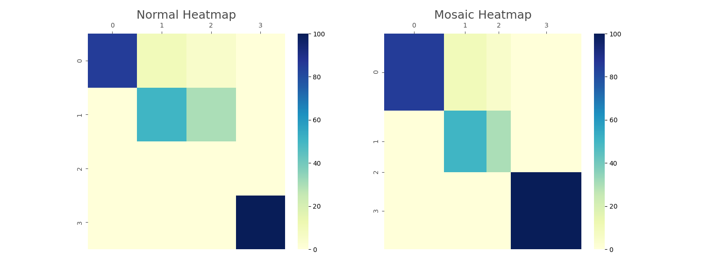
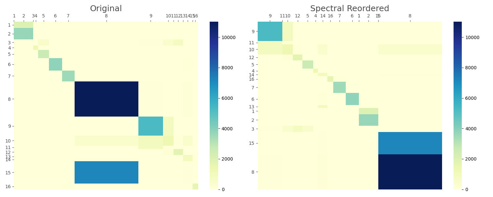
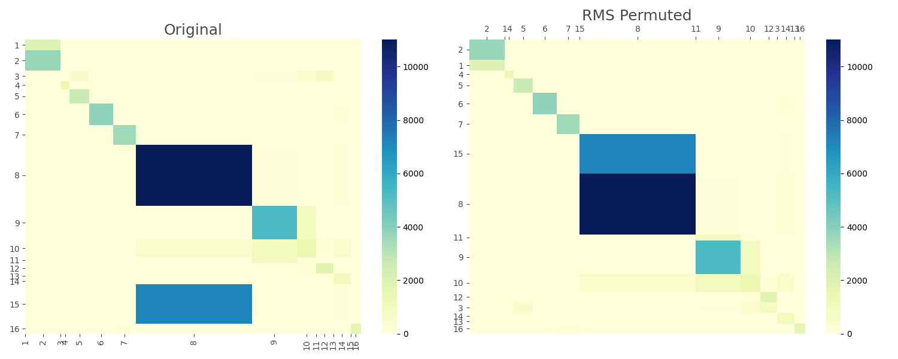

#  mheatmap

[](https://badge.fury.io/py/mheatmap)
[](https://opensource.org/licenses/MIT)

A Python package for advanced heatmap visualization and matrix analysis,
featuring mosaic/proportional heatmaps, confusion matrix post-processing,
and spectral reordering capabilities.

---

## 📋 Table of Contents

1. [🚀 Features](#-features)
2. [📦 Installation](#-installation)
    - [Install from PyPI](#install-from-pypi)
    - [Install from Source](#install-from-source)
3. [📘 Documentation](#-documentation)
4. [📚 Examples](#-examples)
5. [🛠 Contributing](#-contributing)
6. [📝 License](#-license)

---

## 🚀 Features

- **Mosaic Heatmap**  
  Visualize matrix values with proportionally-sized cells.  
  

- **Automatic Model Calibration (AMC)**  
  Align, Mask, and Confusion—an algorithm for post-processing confusion matrices.

- **Spectral Reordering**  
  Reorder matrices based on spectral analysis.
  

- **RMS (Reverse Merge/Split) Analysis**  
  Perform advanced permutation analysis to explore matrix structures.  
  

---

## 📦 Installation

### Install from PyPI

```bash
pip install mheatmap
```

### Install from source

```bash
git clone https://github.com/qqgjyx/mheatmap.git
cd mheatmap
pip install .
```

### Development setup

```bash
uv sync --extra dev      # Install with dev tools (pytest, ruff, pre-commit)
uv run pytest            # Run tests
uv run ruff check src/   # Lint
uv run ruff format src/  # Format
```

## 📘 Documentation

Comprehensive documentation is available [here](https://www.qqgjyx.com/mheatmap).

## 📚 Examples

See [Examples](docs/examples) for more detailed examples.

## 🛠 Contributing

We welcome contributions to improve mheatmap! Please follow these steps:

1. Fork the repository
2. Create a new branch (`feature-branch`)
3. Commit your changes
4. Open a pull request

## 📝 License

This project is licensed under the MIT License.
See the [LICENSE](LICENSE) file for details.
