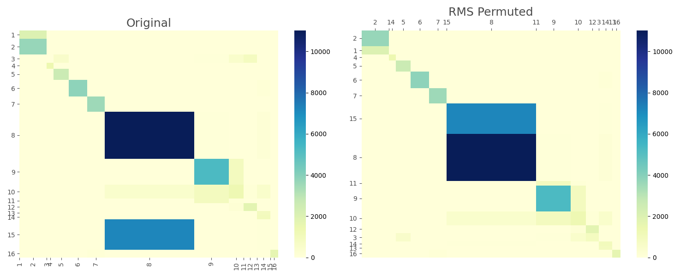

---
hide:
  - navigation
---

#  mheatmap

A Python package for advanced heatmap visualization and matrix analysis,
featuring mosaic/proportional heatmaps, confusion matrix post-processing,
and spectral reordering capabilities.

---

## 🚀 Features

- **Mosaic Heatmap**  
  Visualize matrix values with proportionally-sized cells.  
  

- **Automatic Model Calibration (AMC)**  
  Align, Mask, and Confusion—an algorithm for post-processing confusion matrices.

- **Spectral Reordering**  
  Reorder matrices based on spectral analysis.
  

- **RMS (Reverse Merge/Split) Analysis**  
  Perform advanced permutation analysis to explore matrix structures.  
  

---

## 🛠 Contributing

We welcome contributions to improve mheatmap! Please follow these steps:

1. Fork the repository
2. Create a new branch (`feature-branch`)
3. Commit your changes
4. Open a pull request

## 📝 License

This project is licensed under the MIT License.
See the [LICENSE](https://github.com/qqgjyx/mheatmap/blob/main/LICENSE) file for details.
